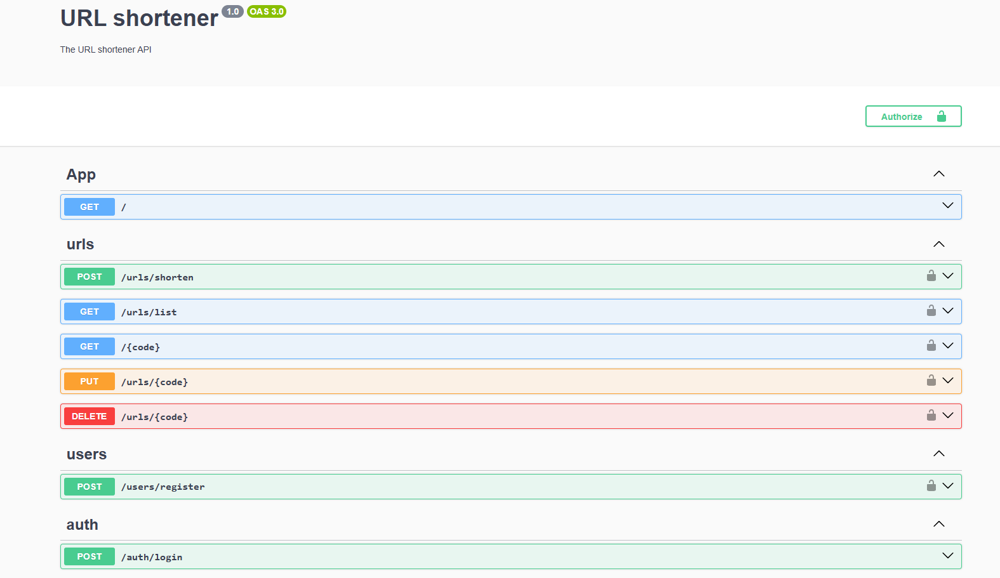
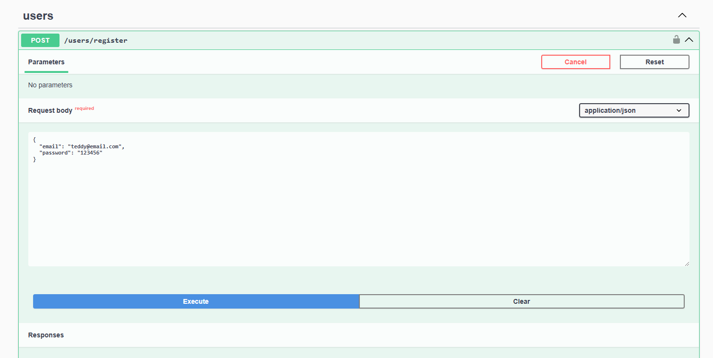
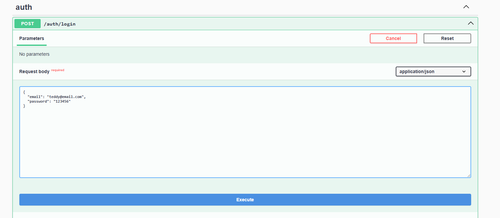
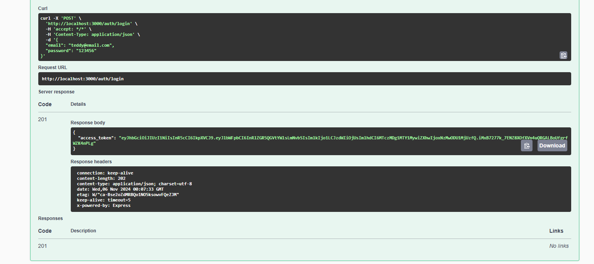
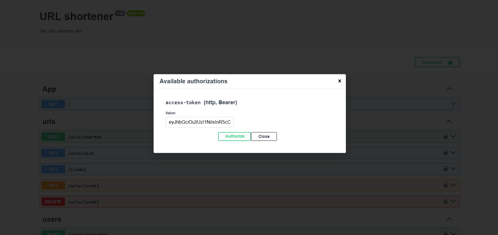
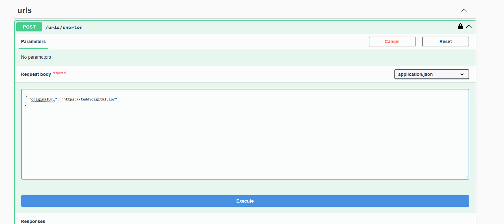
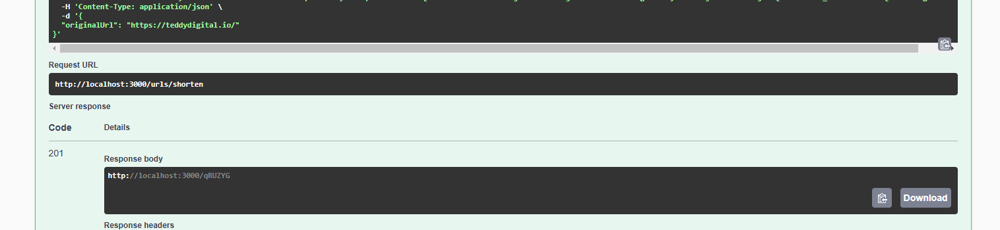
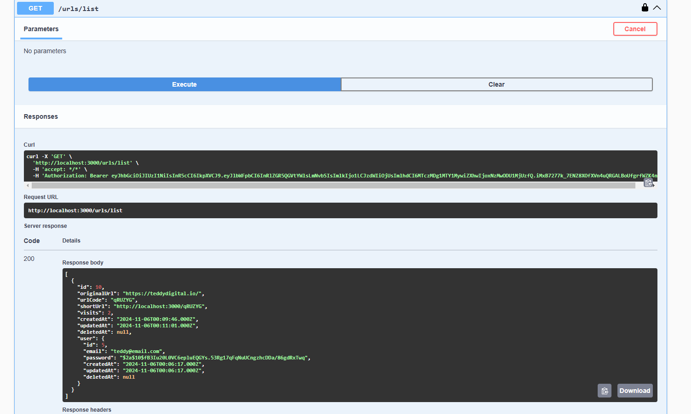

# url-shortener

Tecnologias utilizadas na API:
- Node.JS
- TypeScript
- Nest.JS
- SQLite
- TypeOrm
- Swagger
- JWT 
  
### Passos para utilizar a API/Back-end

1. Clone o repositório e navegue até a pasta principal do projeto (raiz)

2 Instale as depedências com seu gerenciador de pacotes JavaScript
```
pnpm install
```
3. Rode o projeto.
```
pnpm run start:dev
```
4. Utilize a API com a documentação do Swagger.
```
acesse http://localhost:3000/api/
```

5. Crie um usuário.
```
{
  "email": "teddy@email.com",
  "password": "123456" 
}
// a senha requer no mínimo 6 dígitos.
```

6. Faça o login.

7. Resgate o token.

8. Clique no botão `authorize`, cole o valor do token e autorize. 

9. Encurte uma URL. 
```
{
  "originalUrl": "https://teddydigital.io/"
}
```


10. Acesse uma url encurtada. 
11. Liste todas urls do usuário logado. 


Conforme solicitado listagens, atualizações e deleções requerem autenticação, mas, um usuário deslogado ainda pode criar um link encurtado e acessá-lo.

Melhorias: 

- Load balancer para distribuir os acessos a URLs em diferentes instâncias. 
- Uso de cache para fácil recuperação de links. 
- Docker compose para organizar ambiente
- Testes unitários. 